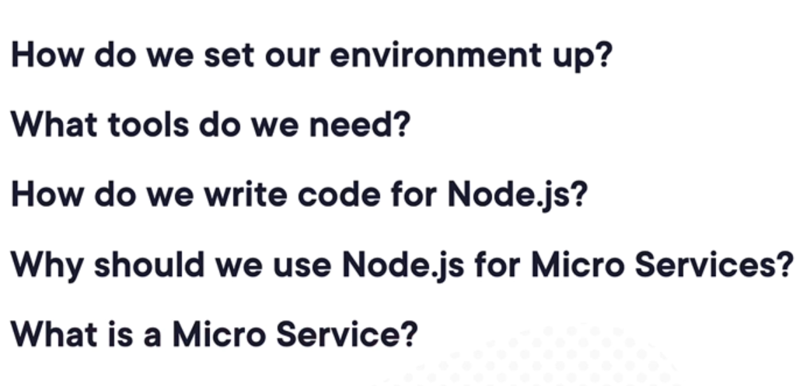
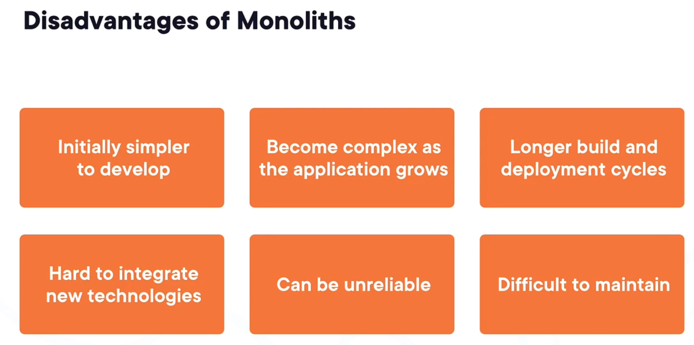
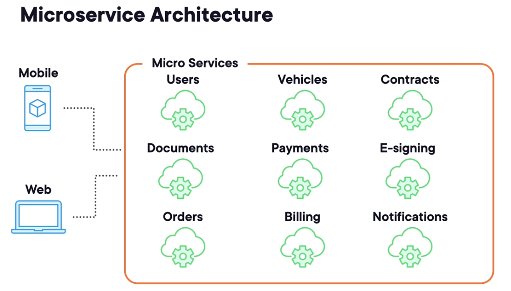

# 2. Introduction

This is the readme file for the 2. Introduction folder.

## 1. Introduction

## 2. Introducing our Scenario

## 3. Understanding Micro Service Architectures

## 4. Introducing Node.JS

## 5. Demo - Exploring the Vehicle Service API

