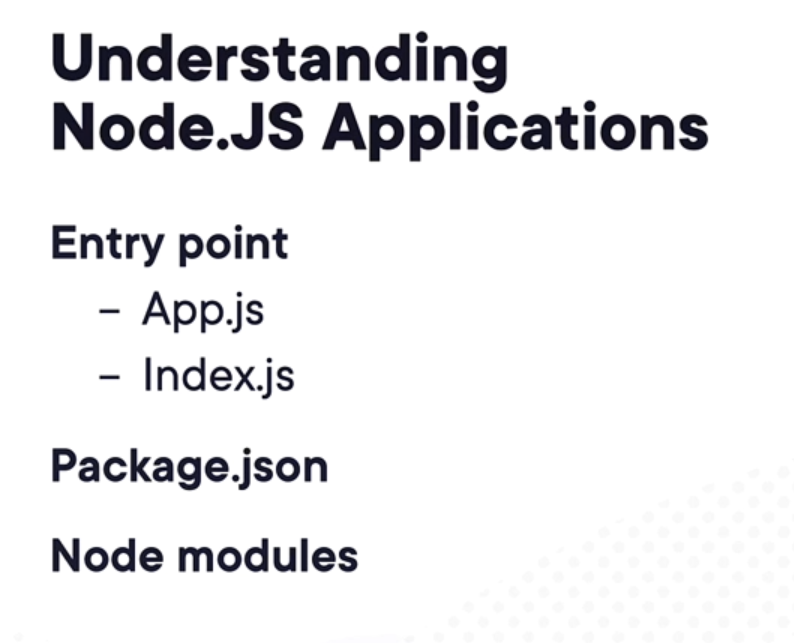
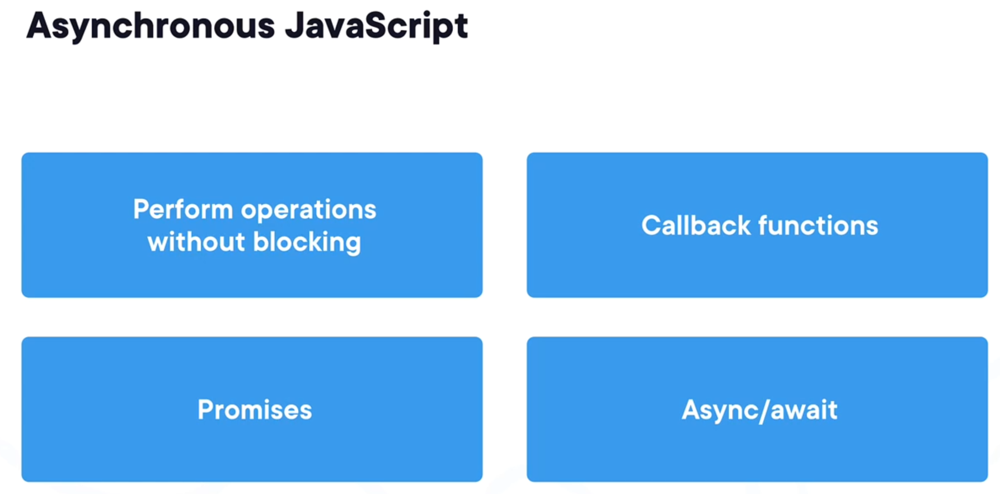
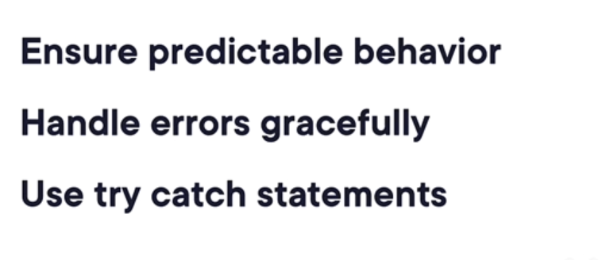
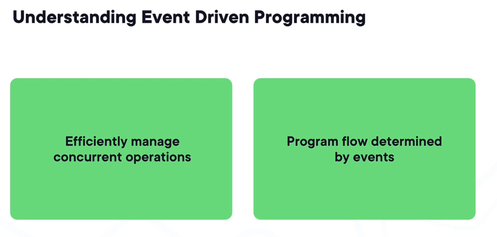
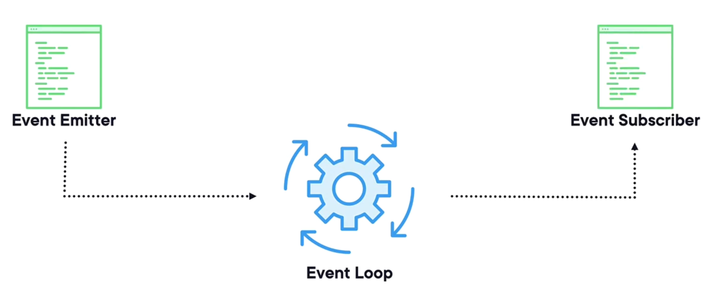
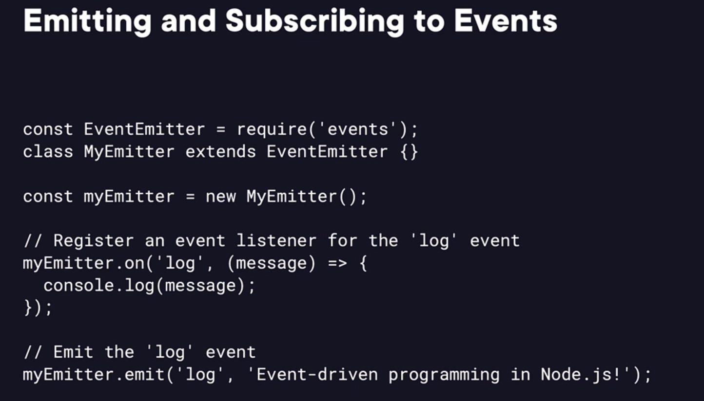

# 3. Getting Started with Node.js

This is the readme file for the 3. Getting Started with Node.js folder.

## 1. Introduction

## 2. Installing Node.JS


## 3. Choosing a Development Environment


## 4. Demo - Setting up Node.JS

## 5. Understanding Node Basics

## 6. Understanding Asyncronous Javascript

The image you uploaded shows key concepts related to **Asynchronous JavaScript**. Let's break down and explain these concepts deeply with examples in **Node.js v22.6.0**, as requested. We'll use real-world scenarios to demonstrate each concept and refer to the Node.js official documentation where relevant.

### 1. **Performing Operations Without Blocking**

Node.js is single-threaded, but it's built on a non-blocking I/O model. This means that you can perform tasks asynchronously without waiting for each task to complete before moving on to the next one.

#### Example:
When performing file system operations, we don't want the entire application to halt while reading a large file. Instead, we use asynchronous functions that allow other parts of the application to continue running while waiting for the file operation to complete.

```js
const fs = require('fs');

// Asynchronous file read
fs.readFile('example.txt', 'utf8', (err, data) => {
  if (err) {
    console.error('Error reading file:', err);
  } else {
    console.log('File content:', data);
  }
});

console.log('Reading file asynchronously...');
```

In this example:
- `fs.readFile()` is non-blocking, meaning the file reading happens in the background.
- The callback is executed once the file is fully read, allowing the `console.log('Reading file asynchronously...')` statement to run immediately, without waiting for the file operation to complete.

Refer to [Node.js File System documentation](https://nodejs.org/docs/latest/api/fs.html#fs_fs_readfile_path_options_callback) for more details on asynchronous file operations.

### 2. **Callback Functions**

A **callback** is a function passed as an argument to another function. It gets called after the completion of the asynchronous operation. Callbacks are the core of asynchronous programming, but they can lead to nested code structures that are hard to manage, commonly referred to as "callback hell."

#### Example:
We can chain multiple asynchronous tasks using callback functions.

```js
const fs = require('fs');

// Asynchronous operation using callbacks
fs.readFile('example.txt', 'utf8', (err, data) => {
  if (err) {
    console.error('Error reading file:', err);
    return;
  }
  console.log('First operation completed:', data);

  // Perform another asynchronous operation inside the callback
  fs.readFile('example2.txt', 'utf8', (err, data) => {
    if (err) {
      console.error('Error reading file 2:', err);
      return;
    }
    console.log('Second operation completed:', data);
  });
});

console.log('Starting file operations...');
```

Here:
- The second `fs.readFile()` operation is nested inside the first one. This can lead to deeply nested code when handling multiple asynchronous tasks, known as "callback hell."

Refer to [Node.js Callbacks](https://nodejs.org/docs/latest/api/fs.html#fs_fs_readfile_path_options_callback) for more information on callback functions.

### 3. **Promises**

**Promises** provide a cleaner way to handle asynchronous operations. They represent a value that may be available now, or in the future, or never. A promise has three states:
- **Pending**: The initial state.
- **Resolved (Fulfilled)**: The operation completed successfully.
- **Rejected**: The operation failed.

#### Example:
Let's convert the previous callback example into a promise-based approach.

```js
const fs = require('fs').promises;

// Asynchronous operation using Promises
fs.readFile('example.txt', 'utf8')
  .then(data => {
    console.log('First operation completed:', data);
    return fs.readFile('example2.txt', 'utf8');
  })
  .then(data => {
    console.log('Second operation completed:', data);
  })
  .catch(err => {
    console.error('Error:', err);
  });

console.log('Starting file operations with Promises...');
```

In this example:
- We use `fs.promises.readFile()` to return a Promise instead of using a callback.
- Promises allow us to handle multiple asynchronous operations more cleanly through chaining with `.then()`.

Refer to [Node.js Promises](https://nodejs.org/docs/latest/api/fs.html#fs_fspromises_readfile_path_options) for more details on how to work with Promises in Node.js.

### 4. **Async/Await**

**Async/await** is a syntactic sugar built on top of Promises that allows you to write asynchronous code as if it were synchronous. It improves readability and helps avoid chaining `.then()` and `.catch()` blocks.

#### Example:
Let's now convert the promise-based example into one using `async/await`.

```js
const fs = require('fs').promises;

// Asynchronous function using async/await
async function processFiles() {
  try {
    const data1 = await fs.readFile('example.txt', 'utf8');
    console.log('First operation completed:', data1);

    const data2 = await fs.readFile('example2.txt', 'utf8');
    console.log('Second operation completed:', data2);
  } catch (err) {
    console.error('Error:', err);
  }
}

console.log('Starting file operations with async/await...');
processFiles();
```

Here:
- The `await` keyword pauses the execution of the function until the promise is resolved or rejected.
- This approach makes the code easier to read and maintain, especially when dealing with multiple asynchronous operations.

Refer to [Node.js Async Functions](https://nodejs.org/docs/latest/api/fs.html#fs_fspromises_readfile_path_options) for more on how `async/await` works with promises.

### Summary:

- **Perform operations without blocking**: Asynchronous operations allow Node.js to perform non-blocking tasks, improving performance.
- **Callback functions**: A foundational method of handling async tasks, but can lead to "callback hell."
- **Promises**: A modern way to handle asynchronous tasks more elegantly with `.then()` and `.catch()`.
- **Async/await**: The most readable and clean approach to working with asynchronous code, built on top of Promises.

Each of these concepts helps developers manage asynchronous behavior in JavaScript, especially in a single-threaded environment like Node.js.
## 7. Handling Errors

Handling errors is a critical part of writing robust and reliable applications in Node.js. When working with asynchronous operations, such as file I/O, database operations, network requests, etc., errors can occur. If not handled properly, these errors can cause your application to crash or behave unexpectedly.

In Node.js (version 22.6.0), error handling involves using several key mechanisms to catch and respond to errors appropriately. These mechanisms include callback-based error handling, promises, `async/await`, `try/catch`, and error events.

Let’s explore error handling in-depth with examples.

### 1. **Callback-based Error Handling**

In the traditional callback approach, the first argument in the callback function is often an error object. If an error occurs, this argument will be populated; otherwise, it will be `null` or `undefined`.

#### Example: Handling Errors with Callbacks

```js
const fs = require('fs');

// Asynchronous function with callback-based error handling
fs.readFile('nonexistentFile.txt', 'utf8', (err, data) => {
  if (err) {
    console.error('Error reading file:', err.message);
    return;
  }
  console.log('File content:', data);
});

console.log('Attempting to read a file...');
```

- **Error Handling**: The `err` parameter is checked. If there’s an error (e.g., the file doesn’t exist), the error message is logged.
- **Non-blocking**: The code continues executing while the file is being read, thanks to asynchronous behavior.

#### Key Points:
- Callback functions handle errors by using an error-first pattern (`err` as the first argument).
- You should always check for the presence of an error and handle it appropriately (e.g., logging, retrying, etc.).
  
Refer to [Node.js File System Documentation](https://nodejs.org/docs/latest/api/fs.html#fs_fs_readfile_path_options_callback) for more about callback-based error handling.

### 2. **Handling Errors with Promises**

With Promises, errors are handled through the `.catch()` method. When an error occurs, the promise is "rejected," and the `.catch()` method is used to handle the rejection.

#### Example: Handling Errors with Promises

```js
const fs = require('fs').promises;

// Asynchronous operation with Promises and error handling
fs.readFile('nonexistentFile.txt', 'utf8')
  .then(data => {
    console.log('File content:', data);
  })
  .catch(err => {
    console.error('Error reading file:', err.message);
  });

console.log('Attempting to read a file using Promises...');
```

- **Error Handling**: The `.catch()` block is used to handle any errors that occur during the promise-based file reading operation.
- **Promise Rejection**: If the file doesn’t exist, the promise is rejected, and the error message is logged.

#### Key Points:
- Promises allow for more readable error handling than callbacks.
- The `.catch()` block catches errors that occur during the execution of the promise chain.

Refer to [Node.js Promises Documentation](https://nodejs.org/docs/latest/api/fs.html#fs_fspromises_readfile_path_options) for more about working with promises and handling errors.

### 3. **Error Handling with `async/await`**

When using `async/await`, you can wrap the asynchronous operations in a `try/catch` block to handle errors. This method simplifies error handling compared to callback or `.then/.catch()` syntax, especially for multiple asynchronous operations.

#### Example: Handling Errors with `async/await` and `try/catch`

```js
const fs = require('fs').promises;

async function readFileAsync() {
  try {
    const data = await fs.readFile('nonexistentFile.txt', 'utf8');
    console.log('File content:', data);
  } catch (err) {
    console.error('Error reading file:', err.message);
  }
}

console.log('Attempting to read a file using async/await...');
readFileAsync();
```

- **Error Handling**: The `try/catch` block is used to handle any errors that occur during the asynchronous operation.
- **Synchronous-like Syntax**: The `await` keyword allows you to handle asynchronous operations in a sequential manner, making the code more readable.

#### Key Points:
- `async/await` is the most modern and readable way to handle asynchronous code and errors.
- The `try/catch` pattern ensures that any errors occurring during `await` operations are caught and handled.

Refer to [Node.js Async Function Documentation](https://nodejs.org/docs/latest/api/fs.html#fs_fspromises_readfile_path_options) for more information on error handling using `async/await`.

### 4. **Handling Errors in EventEmitters**

Node.js applications often use the `EventEmitter` pattern for handling asynchronous events. When using `EventEmitter`, it’s important to handle the `error` event. If an error is emitted and no `error` handler is attached, the application will crash.

#### Example: Handling Errors in EventEmitters

```js
const EventEmitter = require('events');

class MyEmitter extends EventEmitter {}

const myEmitter = new MyEmitter();

// Listen for the error event
myEmitter.on('error', (err) => {
  console.error('An error occurred:', err.message);
});

// Emitting an error event
myEmitter.emit('error', new Error('Something went wrong!'));
```

- **Error Event**: The error is emitted using `emit('error')`.
- **Error Handling**: The `on('error')` listener is attached to handle any error events. Without this listener, the application would crash.

#### Key Points:
- Always listen for the `error` event when using `EventEmitter`.
- Unhandled `error` events can crash the Node.js application.

Refer to [Node.js EventEmitter Documentation](https://nodejs.org/docs/latest/api/events.html#events_error_events) for more details on handling errors in EventEmitters.

### 5. **Handling Uncaught Exceptions and Rejections**

Sometimes, an error can occur that is not caught by the application’s normal error-handling mechanisms. Node.js provides special events for handling these kinds of errors:
- **`uncaughtException`**: Catches exceptions that were not caught in any `try/catch` block.
- **`unhandledRejection`**: Catches promise rejections that were not handled by `.catch()`.

#### Example: Handling Uncaught Exceptions

```js
process.on('uncaughtException', (err) => {
  console.error('Uncaught Exception:', err.message);
  process.exit(1); // Exit the process to avoid unknown state
});

// Trigger an uncaught exception
setTimeout(() => {
  throw new Error('Something went terribly wrong!');
}, 1000);
```

- **Uncaught Exception Handling**: The `uncaughtException` event is triggered when an error is thrown and not caught by any `try/catch` block. You can log the error and cleanly shut down the application.
- **Best Practice**: It’s generally a best practice to exit the process after handling an `uncaughtException` to avoid continuing in an unknown state.

#### Example: Handling Unhandled Promise Rejections

```js
process.on('unhandledRejection', (reason, promise) => {
  console.error('Unhandled Rejection:', reason.message || reason);
  process.exit(1); // Exit the process to avoid unknown state
});

// Trigger an unhandled promise rejection
Promise.reject(new Error('Something went wrong with a promise!'));
```

- **Unhandled Rejection Handling**: The `unhandledRejection` event is fired when a promise is rejected and there is no `.catch()` to handle it. You can log the reason and cleanly shut down the application.

#### Key Points:
- **Uncaught exceptions** and **unhandled promise rejections** should be logged, and the application should be safely terminated to prevent operating in an unstable state.
- You can attach global error handlers using `process.on()` to capture these events.

Refer to [Node.js Process Documentation](https://nodejs.org/docs/latest/api/process.html#process_event_uncaughtexception) for more details on handling uncaught exceptions and unhandled rejections.

### 6. **Throwing Custom Errors**

In some cases, you may want to throw your own custom errors to provide more meaningful error messages or handle specific error scenarios.

#### Example: Throwing Custom Errors

```js
function divide(a, b) {
  if (b === 0) {
    throw new Error('Division by zero is not allowed.');
  }
  return a / b;
}

try {
  const result = divide(10, 0);
  console.log('Result:', result);
} catch (err) {
  console.error('Error:', err.message);
}
```

- **Custom Error**: The `divide()` function throws a custom error if an invalid operation is attempted (division by zero).
- **Error Handling**: The error is caught using a `try/catch` block.

#### Key Points:
- You can create and throw your own custom errors to handle specific conditions.
- Use `try/catch` blocks to capture and handle these custom errors.

Refer to [Node.js Errors Documentation](https://nodejs.org/docs/latest/api/errors.html) for more information on working with errors in Node.js.

---

### Conclusion

Effective error handling in Node.js is crucial for building reliable and maintainable applications. Different approaches exist for handling errors depending on the context (callbacks, promises, `async/await`, events, uncaught exceptions). It’s important to:
- Handle errors locally using `try/catch`, `.catch()`, or event listeners.
- Ensure that global errors like unhandled exceptions and promise rejections are caught
## 8. Understanding Event Driven Programming

The image you've provided highlights two key points regarding **Event-Driven Programming** in Node.js:

1. **Efficiently manage concurrent operations**.
2. **Program flow determined by events**.

Let’s explore **Event-Driven Programming** in depth and explain how it works in Node.js, with real-world examples, using Node.js version 22.6.0. We will also refer to the official Node.js documentation to better understand the event-driven model.

---

### **What is Event-Driven Programming?**

In **event-driven programming**, the flow of the program is determined by events—things like user inputs, sensor outputs, or messages from other programs. Instead of having a linear or predefined flow of execution, programs react to these events asynchronously.

Node.js is built on an event-driven architecture, meaning that:
- **Events** are signals that something has happened.
- **Event handlers** (also known as listeners) respond to those signals and take action when an event occurs.

The core part of Node.js’s event-driven architecture is the **EventEmitter** class from the `events` module, which allows objects to emit events and allows functions to be registered to respond to those events.

### **1. Efficiently Manage Concurrent Operations**

Node.js uses an event-driven model to handle multiple operations concurrently without blocking the execution of the program. This means that multiple tasks can be handled at the same time, and as soon as an event occurs, the relevant callback function is triggered.

#### Example: Concurrent Operations Using EventEmitter

Let’s create an example where we simulate file download operations that run concurrently, and once the files are downloaded, we emit an event that triggers an event handler to process them.

```js
const EventEmitter = require('events');

class DownloadManager extends EventEmitter {
  constructor() {
    super();
  }

  downloadFile(fileName) {
    console.log(`Starting download for ${fileName}...`);

    // Simulate a download operation using setTimeout
    setTimeout(() => {
      console.log(`${fileName} downloaded.`);
      this.emit('fileDownloaded', fileName); // Emit an event when the file is downloaded
    }, Math.random() * 3000); // Random download time between 0 to 3 seconds
  }
}

// Create an instance of DownloadManager
const downloadManager = new DownloadManager();

// Listen for the 'fileDownloaded' event and process the file
downloadManager.on('fileDownloaded', (fileName) => {
  console.log(`Processing ${fileName}...`);
});

// Simulate downloading multiple files concurrently
downloadManager.downloadFile('file1.txt');
downloadManager.downloadFile('file2.txt');
downloadManager.downloadFile('file3.txt');
```
```bash
Starting download for file1.txt...
Starting download for file2.txt...
Starting download for file3.txt...
file3.txt downloaded.
Processing file3.txt...
file1.txt downloaded.
Processing file1.txt...
file2.txt downloaded.
Processing file2.txt...
```
#### Explanation:
- **Efficient Handling**: In this example, we simulate three file downloads. The downloads occur concurrently, meaning that they do not block each other.
- **Event-Driven**: When a file is downloaded, the `fileDownloaded` event is emitted, and the corresponding event handler processes the file. This allows the program to react to each event independently and asynchronously.

### **2. Program Flow Determined by Events**

In event-driven programming, the flow of your application is determined by the events that occur. Rather than writing a linear sequence of operations, you write code that **waits** for certain events to happen and then responds to them.

#### Example: Program Flow with Multiple Events

We can extend the previous example to include additional events, such as starting and completing the processing of the files.

```js
const EventEmitter = require('events');

class DownloadManager extends EventEmitter {
  constructor() {
    super();
  }

  downloadFile(fileName) {
    console.log(`Starting download for ${fileName}...`);

    // Simulate a download operation using setTimeout
    setTimeout(() => {
      console.log(`${fileName} downloaded.`);
      this.emit('fileDownloaded', fileName); // Emit an event when the file is downloaded
    }, Math.random() * 3000);
  }

  processFile(fileName) {
    console.log(`Starting processing for ${fileName}...`);

    // Simulate file processing using setTimeout
    setTimeout(() => {
      console.log(`${fileName} processed.`);
      this.emit('fileProcessed', fileName); // Emit an event when the file is processed
    }, 1000);
  }
}

// Create an instance of DownloadManager
const downloadManager = new DownloadManager();

// Listen for the 'fileDownloaded' event and start processing the file
downloadManager.on('fileDownloaded', (fileName) => {
  downloadManager.processFile(fileName);
});

// Listen for the 'fileProcessed' event
downloadManager.on('fileProcessed', (fileName) => {
  console.log(`${fileName} is ready for further actions.`);
});

// Simulate downloading multiple files concurrently
downloadManager.downloadFile('file1.txt');
downloadManager.downloadFile('file2.txt');
downloadManager.downloadFile('file3.txt');
```
```bash
Starting download for file1.txt...
Starting download for file2.txt...
Starting download for file3.txt...
file1.txt downloaded.
Starting processing for file1.txt...
file3.txt downloaded.
Starting processing for file3.txt...
file2.txt downloaded.
Starting processing for file2.txt...
file1.txt processed.
file1.txt is ready for further actions.
file3.txt processed.
file3.txt is ready for further actions.
file2.txt processed.
file2.txt is ready for further actions.
```


#### Explanation:
- **Multiple Event Types**: We’ve introduced two events, `fileDownloaded` and `fileProcessed`. The program flow is now determined by these events.
- **Reacting to Events**: Once a file is downloaded, it triggers the `fileDownloaded` event, which starts the processing of the file. When the file is processed, it triggers the `fileProcessed` event.

This approach ensures that the program reacts dynamically to events as they happen, rather than following a predefined, linear flow.

### **EventEmitter in Node.js**

In Node.js, the `EventEmitter` class is at the heart of event-driven programming. It provides the mechanism for emitting and listening for events. Here's a brief overview of the key methods and properties of `EventEmitter`:

- **`on(eventName, listener)`**: Registers a listener function to respond to an event.
- **`emit(eventName, [...args])`**: Emits an event, causing all registered listeners for that event to be called.
- **`once(eventName, listener)`**: Registers a listener that is invoked at most once for a specific event. It’s removed after being invoked.
- **`removeListener(eventName, listener)`**: Removes a specific listener from the event.

For more detailed documentation, you can refer to the [Node.js Events Documentation](https://nodejs.org/docs/latest/api/events.html).

### **Real-World Applications of Event-Driven Programming in Node.js**

1. **Server-Side Events**: 
   - Node.js web servers, such as those created with the `http` module or frameworks like Express, are event-driven. The server listens for events like HTTP requests (`request` event) and responds when these events occur.

   ```js
   const http = require('http');

   const server = http.createServer((req, res) => {
     if (req.method === 'GET') {
       res.writeHead(200, { 'Content-Type': 'text/plain' });
       res.end('Hello, world!');
     }
   });

   server.listen(3000, () => {
     console.log('Server running on http://localhost:3000');
   });
   ```

   - The server waits for events (e.g., `request` events), and when a request is received, the server responds accordingly.

2. **Real-Time Applications**:
   - Event-driven programming is essential in real-time applications like chat apps or online gaming. Events such as new messages or user actions are emitted and handled immediately.
   - Libraries like **Socket.io** use event-driven programming to listen for events such as "message" or "connection" and react to them.

   ```js
   const io = require('socket.io')(3000);

   io.on('connection', (socket) => {
     console.log('A user connected');
     
     socket.on('message', (data) => {
       console.log('Message received:', data);
     });

     socket.on('disconnect', () => {
       console.log('User disconnected');
     });
   });
   ```

   In this example, we use WebSockets to handle real-time events, like a user sending a message or connecting to the server.

3. **File System Events**:
   - Node.js’s `fs` module can also emit events. For instance, when watching a file or directory for changes using `fs.watch()`, you can handle events such as file modifications or deletions.

   ```js
   const fs = require('fs');

   fs.watch('example.txt', (eventType, filename) => {
     if (filename) {
       console.log(`File ${filename} has been modified`);
     }
   });
   ```

   - This is useful for applications that need to respond to changes in the file system, like reloading a configuration file when it’s updated.

### **Conclusion**

Event-Driven Programming is a powerful programming paradigm, particularly in Node.js, because it allows for efficient management of asynchronous operations, enabling concurrent tasks without blocking the flow of the program.

- **Efficiently manage concurrent operations**: Node.js uses an event loop to handle concurrent operations efficiently. Multiple events can be processed in parallel without blocking each other.
- **Program flow determined by events**: Program flow isn’t linear but determined by the occurrence of events. The application reacts to specific events by invoking listeners (callback functions) that handle those events.

By leveraging the event-driven nature of Node.js, developers can build highly scalable, responsive, and efficient applications, especially when dealing with real-time data, I/O-bound operations, or concurrent tasks.

The image you've provided depicts the relationship between an **Event Emitter**, the **Event Loop**, and an **Event Subscriber** in the context of event-driven programming in Node.js. Let’s dive deeper into how these components work together, with real-world examples in **Node.js v22.6.0**.

---

### **Understanding the Components**

1. **Event Emitter**: 
   - The **Event Emitter** is an object that emits (or triggers) events. When an event is emitted, it signals that something has happened.
   - In Node.js, the `EventEmitter` class, which is part of the `events` module, provides a way to handle this pattern.
  
2. **Event Loop**:
   - The **Event Loop** is the core of Node.js’s non-blocking I/O model. It allows Node.js to handle asynchronous tasks (like reading files or making network requests) without blocking the main thread.
   - The Event Loop waits for events to occur and then dispatches those events to the appropriate listeners (or handlers) in the form of callbacks.

3. **Event Subscriber**:
   - The **Event Subscriber** is any function or object that listens to specific events emitted by the Event Emitter.
   - The subscriber defines a handler (callback function) that gets executed when a specific event is triggered.

---

### **How It Works in Node.js**

In Node.js, the **Event Emitter** emits events, the **Event Loop** listens for these events, and the **Event Subscribers** (or listeners) handle the events by performing specific actions. Let’s walk through an example that demonstrates this process.

### **Step-by-Step Example**

Let’s create a simple event-driven system that simulates a file download process. When the file is downloaded, an event is emitted, and a subscriber listens to this event to process the downloaded file.

#### **Step 1: Create the Event Emitter**

First, we need to create a class that extends the `EventEmitter` class. This class will emit events after simulating the file download process.

```js
const EventEmitter = require('events');

class DownloadManager extends EventEmitter {
  constructor() {
    super();
  }

  // Simulate file download
  downloadFile(fileName) {
    console.log(`Starting download for: ${fileName}`);

    // Simulate asynchronous download using setTimeout
    setTimeout(() => {
      console.log(`${fileName} downloaded.`);
      
      // Emit the 'fileDownloaded' event when download is complete
      this.emit('fileDownloaded', fileName);
    }, Math.random() * 3000); // Random download time between 0 and 3 seconds
  }
}
```

#### Explanation:
- **DownloadManager**: This class extends `EventEmitter`. It includes a method called `downloadFile()`, which simulates a file download using `setTimeout()`.
- **Event Emission**: Once the file download is complete, the `fileDownloaded` event is emitted using `this.emit()`.

#### **Step 2: Create an Event Subscriber**

Now, we’ll create an event subscriber that listens for the `fileDownloaded` event and responds by processing the file.

```js
const downloadManager = new DownloadManager();

// Event Subscriber listens for the 'fileDownloaded' event
downloadManager.on('fileDownloaded', (fileName) => {
  console.log(`Processing the downloaded file: ${fileName}`);
});

// Simulate downloading multiple files
downloadManager.downloadFile('file1.txt');
downloadManager.downloadFile('file2.txt');
downloadManager.downloadFile('file3.txt');
```

#### Explanation:
- **Event Subscriber**: The `downloadManager.on()` method registers an event listener for the `fileDownloaded` event. When this event is emitted, the subscriber (callback function) will be executed, which processes the downloaded file.
- **Asynchronous Flow**: The files are downloaded asynchronously, and as each download completes, the respective event is emitted and handled.

### **How the Event Loop Fits In**

The **Event Loop** plays a crucial role in this asynchronous, event-driven system. Here’s how it works step-by-step:

1. **Event Emitter Starts the Operation**: When `downloadManager.downloadFile()` is called, it simulates a file download. This doesn’t block the execution of other code.
   
2. **Event Loop Waits**: The Event Loop continues to run, checking for other tasks or events that need to be handled. It doesn't wait for the file download to complete before moving on to the next file.
   
3. **Event Emission**: When the file is downloaded (after the `setTimeout` completes), the `fileDownloaded` event is emitted.
   
4. **Event Loop Detects Event**: The Event Loop detects that the `fileDownloaded` event has been emitted and looks for any subscribers (listeners) that are registered for this event.
   
5. **Event Subscriber Executes**: The callback function subscribed to the `fileDownloaded` event is called, and the file is processed.

### **Complete Example Output**

If you run the code, you might see output similar to this (the order may vary due to the random download times):

```bash
Starting download for: file1.txt
Starting download for: file2.txt
Starting download for: file3.txt
file1.txt downloaded.
Processing the downloaded file: file1.txt
file2.txt downloaded.
Processing the downloaded file: file2.txt
file3.txt downloaded.
Processing the downloaded file: file3.txt
```

### **Real-World Use Cases of Event-Driven Programming in Node.js**

1. **Web Servers**:
   - Web servers (like those created using `http` or `express`) use event-driven architecture. Each incoming request triggers an event, and the server responds to the event asynchronously.
   
   ```js
   const http = require('http');

   const server = http.createServer((req, res) => {
     if (req.method === 'GET') {
       res.writeHead(200, { 'Content-Type': 'text/plain' });
       res.end('Hello, world!');
     }
   });

   server.listen(3000, () => {
     console.log('Server running on http://localhost:3000');
   });
   ```

   Here, the `createServer()` method listens for the `request` event, and when a request is received, the server responds asynchronously.

2. **Real-Time Applications**:
   - Applications like chat apps or online games use event-driven programming to handle real-time interactions. For example, a message is sent, and an event is emitted to notify other users.
   - Libraries like **Socket.io** are built around the event-driven model for handling WebSocket communication.

   ```js
   const io = require('socket.io')(3000);

   io.on('connection', (socket) => {
     console.log('A user connected');
     
     socket.on('message', (msg) => {
       console.log('Message received:', msg);
     });

     socket.on('disconnect', () => {
       console.log('User disconnected');
     });
   });
   ```

   In this example, the `connection` and `message` events are emitted and handled to manage real-time user interactions.

3. **File System Watchers**:
   - The Node.js `fs` module emits events when files are modified. You can watch a file or directory for changes and handle the events when they occur.

   ```js
   const fs = require('fs');

   fs.watch('example.txt', (eventType, filename) => {
     if (filename) {
       console.log(`File ${filename} has been modified`);
     }
   });
   ```

   Here, the `fs.watch()` method listens for changes in the file and emits events whenever the file is modified.

### **The Importance of the Event Loop**

The **Event Loop** is the engine that powers Node.js’s non-blocking I/O operations. It works in the background, managing asynchronous tasks like timers (`setTimeout`), network requests, file I/O, and events emitted by the EventEmitter.

1. **Tasks Are Offloaded**: When an asynchronous operation is initiated (like reading a file), the task is offloaded to the operating system or a background thread.
   
2. **Event Loop Polls for Completion**: The Event Loop continuously checks if the operation has completed.
   
3. **Callback Execution**: Once the task completes (such as a file being read or a request completing), the callback is placed in the Event Loop’s queue, waiting to be executed.
   
4. **Processing Events**: The Event Loop processes events as they occur, ensuring that event subscribers (listeners) are triggered when their respective events are emitted.

---

### **Conclusion**

The diagram illustrates the flow of an event-driven architecture where:

- The **Event Emitter** emits events when certain tasks are completed (like a file download).
- The **Event Loop** manages these events asynchronously without blocking the execution of other tasks.
- The **Event Subscriber** (or listener) is responsible for handling the emitted events and performing specific actions in response.

In **Node.js**, this event-driven architecture allows for scalable and efficient applications, especially when dealing with I/O-bound or real-time operations. By leveraging the `EventEmitter` class and the Event Loop, developers can build systems that react dynamically to the occurrence of various events, all while maintaining a non-blocking execution model.

## 9. Demo - Creating a Node.JS Application

The image you've shared contains a simple example of creating an HTTP server using **Node.js**. Let’s go through the code step by step, explain each part, and explore how to build an HTTP server using **Node.js v22.6.0**. I'll also provide some context from the Node.js official documentation.

---

### Code Breakdown

```javascript
const http = require('http');

const hostname = '127.0.0.1';
const port = 3000;

const server = http.createServer((req, res) => {
  res.statusCode = 200;
  res.setHeader('Content-Type', 'text/plain');
  res.end('Hello Node\n');
});

server.listen(port, hostname, () => {
  console.log(`Server running at http://${hostname}:${port}/`);
});
```

### **1. `const http = require('http');`**

- Here, we are importing the built-in **`http`** module, which provides utilities for creating and managing HTTP servers and clients.
- **`http`** is one of Node.js’s core modules, meaning it’s available out of the box without needing to install any external packages.

Refer to the [Node.js HTTP Documentation](https://nodejs.org/docs/latest/api/http.html) for more details on the `http` module.

### **2. Define the Server Details: `hostname` and `port`**

```javascript
const hostname = '127.0.0.1';
const port = 3000;
```

- **`hostname`**: This specifies the domain or IP address where the server will be available. `'127.0.0.1'` is the **loopback address**, commonly referred to as **localhost**, meaning that the server will be accessible only from the local machine.
- **`port`**: The port on which the server will listen for incoming HTTP requests. In this example, the server listens on port `3000`.

You can change the hostname to something like `'0.0.0.0'` if you want the server to be accessible externally (i.e., from other machines).

### **3. Creating the HTTP Server: `http.createServer()`**

```javascript
const server = http.createServer((req, res) => {
  res.statusCode = 200;
  res.setHeader('Content-Type', 'text/plain');
  res.end('Hello Node\n');
});
```

- **`http.createServer()`**: This function creates an HTTP server that listens for requests. It takes a callback function with two parameters:
  - **`req`**: Represents the incoming request. This contains details about the HTTP request, such as the URL, headers, and request method.
  - **`res`**: Represents the server's response. This object is used to send a response back to the client.

Here’s what happens inside the callback:
- **`res.statusCode = 200;`**: This sets the HTTP status code for the response. `200` means "OK," indicating that the request was successful.
- **`res.setHeader('Content-Type', 'text/plain');`**: This sets the `Content-Type` header for the response, telling the client that the response body is plain text.
- **`res.end('Hello Node\n');`**: This ends the response and sends the string `'Hello Node\n'` as the response body.

#### Additional Explanation:
- The `statusCode` is crucial because it tells the client whether the request was successful (`200`), caused a redirection (`3xx`), resulted in a client error (`4xx`), or a server error (`5xx`).
- The `Content-Type` header is important for the browser (or client) to know how to interpret the content. Here it’s set to `text/plain`, meaning plain text, but it could be `application/json` for JSON data or `text/html` for HTML.

Refer to the [Node.js HTTP Server Response Documentation](https://nodejs.org/docs/latest/api/http.html#http_class_http_serverresponse) for more details on handling server responses.

### **4. Starting the Server: `server.listen()`**

```javascript
server.listen(port, hostname, () => {
  console.log(`Server running at http://${hostname}:${port}/`);
});
```

- **`server.listen()`**: This method starts the server and makes it listen for incoming requests on the specified `hostname` and `port`.
  - **`port`**: The port number the server should listen on.
  - **`hostname`**: The IP address or domain name the server is bound to.
  
The third argument is a callback function that is executed when the server starts successfully. Here, it logs the server’s address (`http://127.0.0.1:3000/`) to the console.

#### Additional Explanation:
- **Port**: In a real-world application, the port is crucial as it defines where the client can send requests. Common ports include `80` for HTTP and `443` for HTTPS.
- **Hostname**: Setting the hostname to `'127.0.0.1'` ensures that the server is accessible only on the local machine. Setting it to `'0.0.0.0'` makes it accessible on any network interface.

Refer to the [Node.js HTTP Server Listen Documentation](https://nodejs.org/docs/latest/api/http.html#http_server_listen) for more details on how to configure the server's listening behavior.

---

### **Testing the Server**

Once this code is running, open a terminal and run the script with **Node.js**:

```bash
node server.js
```

You should see the message:

```bash
Server running at http://127.0.0.1:3000/
```

Now, open a browser and navigate to `http://127.0.0.1:3000/`. You should see the following response in plain text:

```
Hello Node
```

This confirms that the server is working as expected. You can also test the server using tools like **Postman** or **curl** to send requests.

For example, using `curl`:

```bash
curl http://127.0.0.1:3000/
```

This will print:

```
Hello Node
```

### **Adding Features to the HTTP Server**

While this is a basic server, you can extend it to handle different types of requests (GET, POST, etc.), routes (URLs), and even serve JSON or HTML.

#### Handling Different Routes:
You can enhance the server to respond differently depending on the requested URL.

```javascript
const server = http.createServer((req, res) => {
  res.setHeader('Content-Type', 'text/plain');
  
  if (req.url === '/') {
    res.statusCode = 200;
    res.end('Welcome to the Home Page!\n');
  } else if (req.url === '/about') {
    res.statusCode = 200;
    res.end('This is the About Page.\n');
  } else {
    res.statusCode = 404;
    res.end('Page Not Found.\n');
  }
});
```

Here, the server responds differently depending on the request’s URL:
- For the root URL (`/`), it sends a "Welcome" message.
- For `/about`, it sends an "About Page" message.
- For any other URL, it responds with a `404` status code (Not Found) and an appropriate message.

#### Sending JSON Responses:
You can also use this HTTP server to send JSON data by changing the `Content-Type` header.

```javascript
const server = http.createServer((req, res) => {
  res.setHeader('Content-Type', 'application/json');
  
  const responseObject = {
    message: 'Hello, this is a JSON response',
    timestamp: new Date()
  };
  
  res.statusCode = 200;
  res.end(JSON.stringify(responseObject));
});
```

In this case, the response is a JSON object containing a message and a timestamp.

### **Conclusion**

This example demonstrates how to set up a basic HTTP server using **Node.js v22.6.0**. The server listens for requests, handles them asynchronously, and sends back responses, either as plain text, JSON, or based on routes.

The **`http`** module is fundamental to building web applications in Node.js. While this example is simple, it lays the groundwork for building more complex applications, including REST APIs, web servers with different routes, and services that handle various request methods (GET, POST, etc.).

To learn more and dive deeper into other aspects of the `http` module, refer to the [Node.js HTTP Module Documentation](https://nodejs.org/docs/latest/api/http.html).