# 3. Getting Started with Node.js

This is the readme file for the 3. Getting Started with Node.js folder.

## 1. Introduction
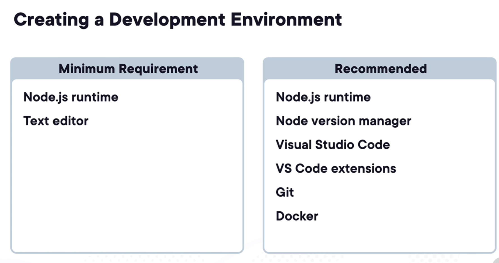
## 2. Installing Node.JS
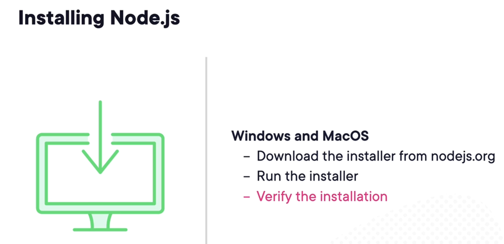
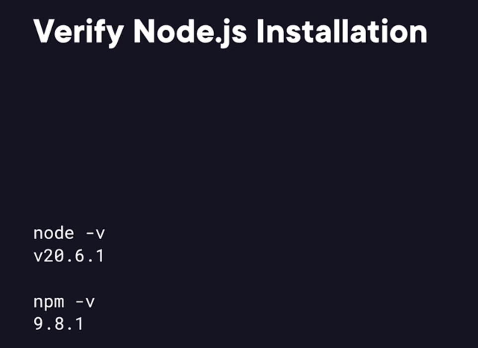
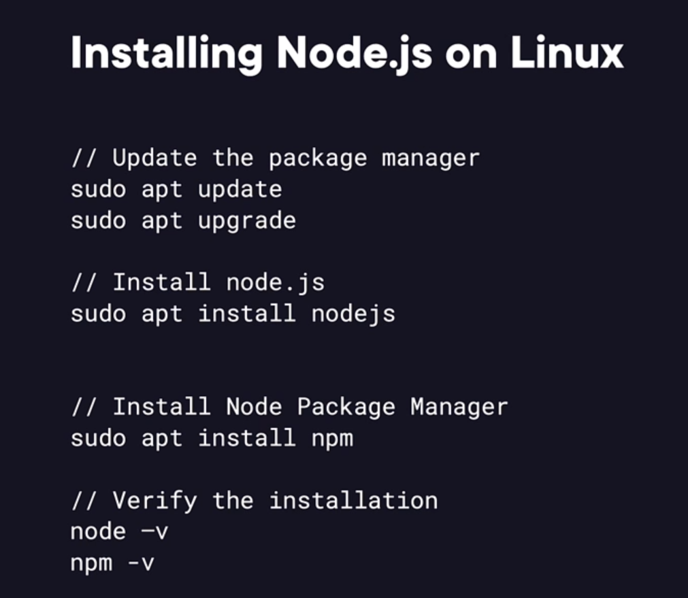
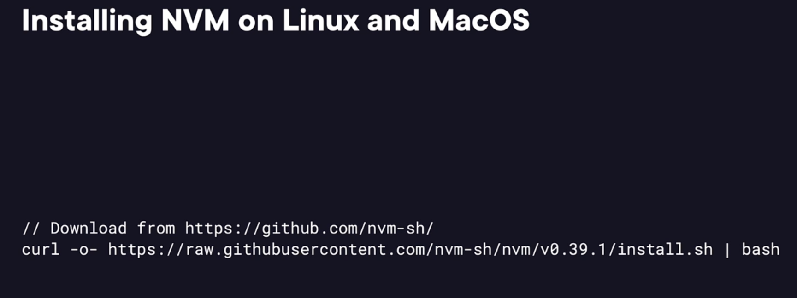
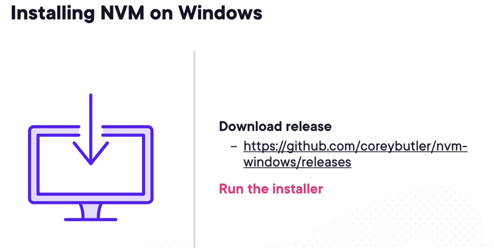
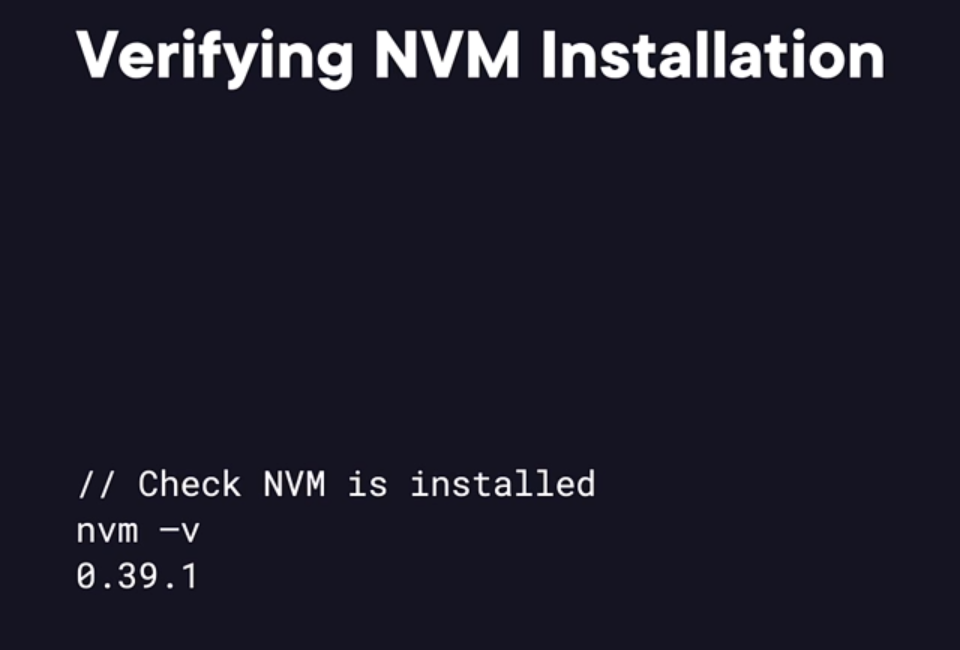

## 3. Choosing a Development Environment
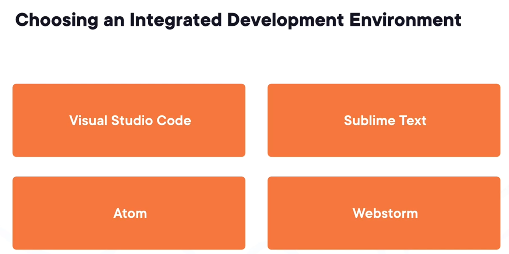
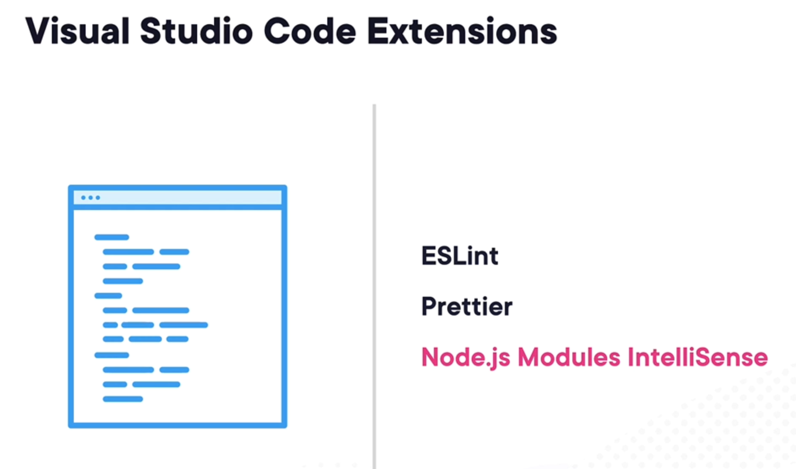
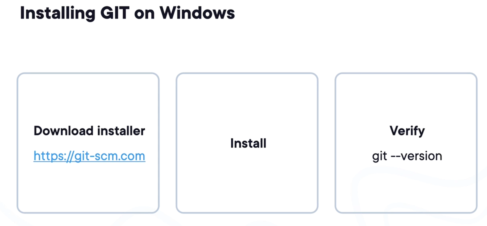
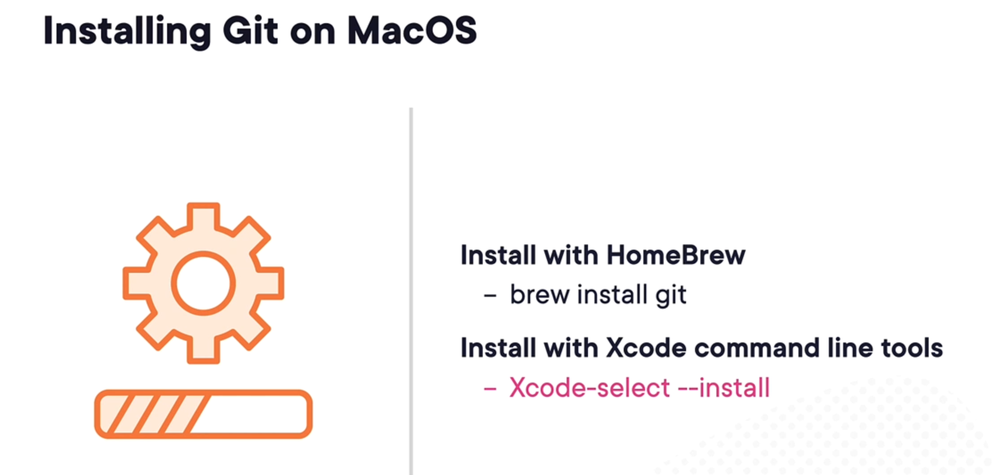
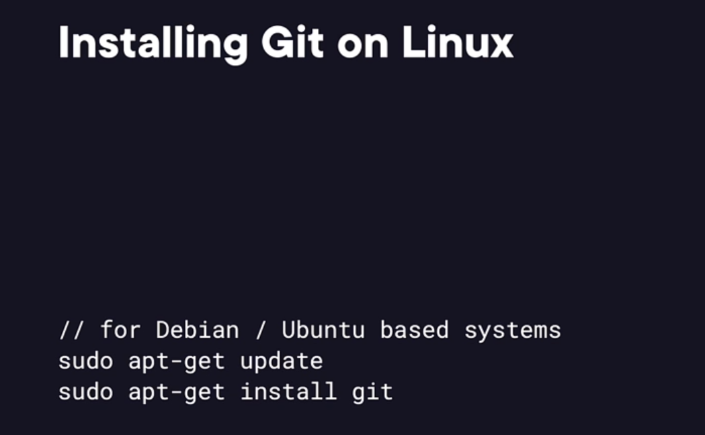
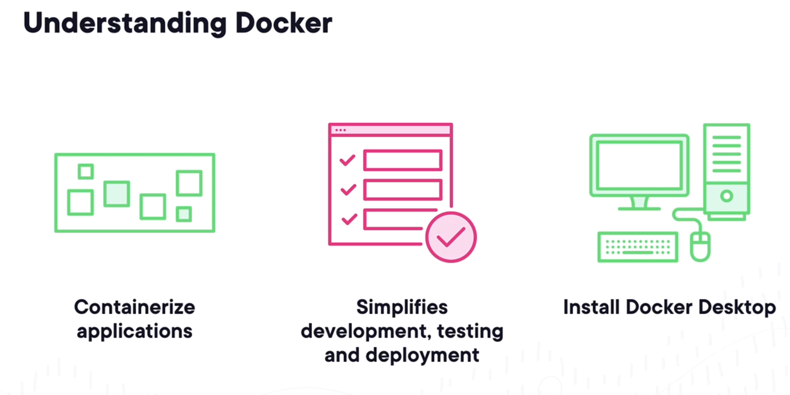
## 4. Demo - Setting up Node.JS
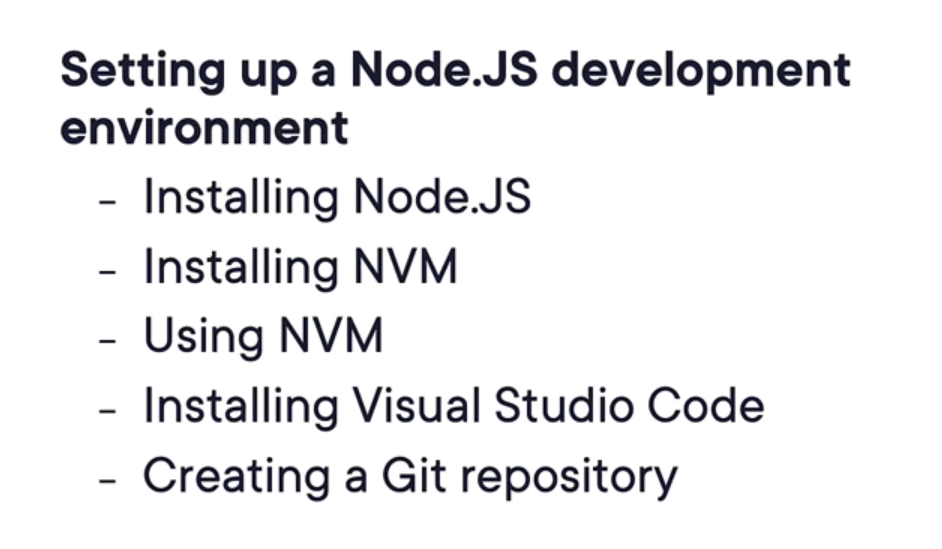
## 5. Understanding Node Basics

## 6. Understanding Asyncronous Javascript

## 7. Handling Errors

## 8. Understanding Event Driven Programming

## 9. Demo - Creating a Node.JS Application

