# 4. Designing an API

This is the readme file for the 4. Designing an API folder.

## 1. Introducing API Design
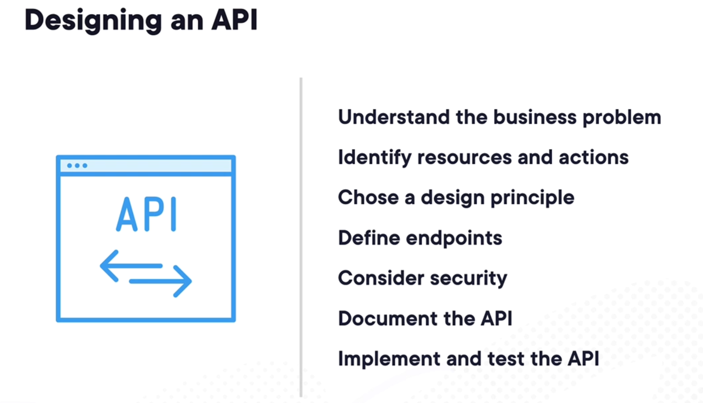
Designing an API involves multiple steps, from understanding the business problem to implementing and testing the API. Let’s dive deep into the steps for designing an API, focusing on Node.js (v22.6.0) and Express.js (v5.x), and explore examples using relevant concepts from these frameworks. We'll also reference the official Node.js and Express.js documentation for context.

### 1. **Understand the Business Problem**

Before designing any API, you need to understand **what problem** it aims to solve. This could be a business requirement, such as allowing users to register, authenticate, and retrieve data in an application. For example, consider an API for a **movie database** where users can fetch details about movies and add them to their watchlist.

---

### 2. **Identify Resources and Actions**

In RESTful APIs, **resources** represent entities, and **actions** represent HTTP methods that manipulate those resources. 

For the **movie database** example, resources might include:
- **Movies**: A collection of movies with details like title, genre, rating, etc.
- **Watchlist**: A user-specific list of movies they want to watch.

Actions:
- `GET /movies`: Retrieve a list of movies.
- `POST /watchlist`: Add a movie to the user’s watchlist.
- `GET /watchlist`: Retrieve the user’s watchlist.

---

### 3. **Choose a Design Principle (RESTful)**

A common API design principle is **REST (Representational State Transfer)**, which focuses on resources and uses standard HTTP methods. Express.js is ideal for creating RESTful APIs due to its simplicity and flexibility.

For example:
- **GET**: Retrieve resources.
- **POST**: Create resources.
- **PUT**: Update resources.
- **DELETE**: Remove resources.

---

### 4. **Define Endpoints**

Endpoints are the URLs through which clients interact with the API. In Express.js, you define routes using functions like `app.get()`, `app.post()`, etc.

#### Example of Defining Endpoints:

Let's create an Express.js application for a movie database API.

**Installation and Setup:**

```bash
npm init -y
npm install express
```

**Code (Node.js v22.6.0 with Express.js v5.x):**

```js
const express = require('express');
const app = express();
app.use(express.json()); // Middleware to parse JSON request bodies

// Mock data
let movies = [
  { id: 1, title: 'Inception', genre: 'Sci-Fi', year: 2010 },
  { id: 2, title: 'The Matrix', genre: 'Sci-Fi', year: 1999 }
];

// GET /movies - Retrieve all movies
app.get('/movies', (req, res) => {
  res.json(movies);
});

// POST /movies - Add a new movie
app.post('/movies', (req, res) => {
  const newMovie = {
    id: movies.length + 1,
    title: req.body.title,
    genre: req.body.genre,
    year: req.body.year
  };
  movies.push(newMovie);
  res.status(201).json(newMovie); // 201 Created
});

// GET /movies/:id - Retrieve a specific movie by ID
app.get('/movies/:id', (req, res) => {
  const movie = movies.find(m => m.id === parseInt(req.params.id));
  if (!movie) return res.status(404).json({ error: 'Movie not found' });
  res.json(movie);
});

// PUT /movies/:id - Update a movie by ID
app.put('/movies/:id', (req, res) => {
  const movie = movies.find(m => m.id === parseInt(req.params.id));
  if (!movie) return res.status(404).json({ error: 'Movie not found' });

  movie.title = req.body.title;
  movie.genre = req.body.genre;
  movie.year = req.body.year;
  res.json(movie);
});

// DELETE /movies/:id - Delete a movie by ID
app.delete('/movies/:id', (req, res) => {
  movies = movies.filter(m => m.id !== parseInt(req.params.id));
  res.status(204).send(); // 204 No Content
});

// Start server
const PORT = process.env.PORT || 3000;
app.listen(PORT, () => console.log(`Server running on port ${PORT}`));
```

**Key Takeaways:**
- **Endpoints**:
  - `GET /movies`: Fetch all movies.
  - `POST /movies`: Add a new movie.
  - `GET /movies/:id`: Fetch a movie by ID.
  - `PUT /movies/:id`: Update a movie by ID.
  - `DELETE /movies/:id`: Delete a movie by ID.
- **Express Middleware**: `express.json()` parses incoming requests with JSON payloads.
  
---

### 5. **Consider Security**

API security is crucial. Here are a few key security measures:
- **Authentication & Authorization**: Use **JWT (JSON Web Tokens)** or **OAuth** to secure your API endpoints. For example, a user must authenticate before accessing their watchlist.
  
- **Rate Limiting**: Implement rate limiting to prevent abuse of the API.

- **Input Validation**: Always validate input to prevent attacks like **SQL Injection** or **XSS (Cross-Site Scripting)**.

#### Example: Basic JWT Authentication with Express.js

```bash
npm install jsonwebtoken bcryptjs
```

```js
const jwt = require('jsonwebtoken');
const bcrypt = require('bcryptjs');

const users = []; // In-memory user storage for demo purposes

// POST /register - Register a new user
app.post('/register', async (req, res) => {
  const hashedPassword = await bcrypt.hash(req.body.password, 10);
  const user = { username: req.body.username, password: hashedPassword };
  users.push(user);
  res.status(201).json({ message: 'User registered' });
});

// POST /login - Authenticate user
app.post('/login', (req, res) => {
  const user = users.find(u => u.username === req.body.username);
  if (!user || !bcrypt.compareSync(req.body.password, user.password)) {
    return res.status(403).json({ error: 'Invalid credentials' });
  }
  
  const token = jwt.sign({ username: user.username }, 'secretkey', { expiresIn: '1h' });
  res.json({ token });
});

// Middleware to protect routes
const authenticateToken = (req, res, next) => {
  const token = req.header('Authorization')?.split(' ')[1];
  if (!token) return res.status(401).json({ error: 'Access denied' });

  jwt.verify(token, 'secretkey', (err, user) => {
    if (err) return res.status(403).json({ error: 'Invalid token' });
    req.user = user;
    next();
  });
};

// Example of a protected route
app.get('/watchlist', authenticateToken, (req, res) => {
  res.json({ message: `Welcome, ${req.user.username}!` });
});
```

---

### 6. **Document the API**

API documentation is essential for developers who will consume the API. Tools like **Swagger** or **Postman** can help generate interactive API documentation.

#### Example: Using Swagger to Document Your API

You can use **Swagger** to generate interactive documentation. Install `swagger-jsdoc` and `swagger-ui-express`:

```bash
npm install swagger-jsdoc swagger-ui-express
```

```js
const swaggerJsDoc = require('swagger-jsdoc');
const swaggerUi = require('swagger-ui-express');

const swaggerOptions = {
  swaggerDefinition: {
    info: {
      title: 'Movie API',
      description: 'API for managing a movie database',
      version: '1.0.0'
    }
  },
  apis: ['app.js']
};

const swaggerDocs = swaggerJsDoc(swaggerOptions);
app.use('/api-docs', swaggerUi.serve, swaggerUi.setup(swaggerDocs));

// Now you can visit http://localhost:3000/api-docs to see the Swagger UI
```

Add documentation annotations directly to your route handlers in the code.

---

### 7. **Implement and Test the API**

After the API is designed and documented, it's crucial to test it thoroughly. Tools like **Jest**, **Supertest**, and **Postman** can help automate testing for your API.

#### Example: Testing an API with Supertest

```bash
npm install supertest jest
```

Add a simple test file `app.test.js`:

```js
const request = require('supertest');
const app = require('./app'); // Your Express app

describe('Movie API', () => {
  it('should fetch all movies', async () => {
    const res = await request(app).get('/movies');
    expect(res.statusCode).toBe(200);
    expect(res.body).toHaveLength(2);
  });

  it('should add a new movie', async () => {
    const res = await request(app).post('/movies').send({
      title: 'Interstellar',
      genre: 'Sci-Fi',
      year: 2014
    });
    expect(res.statusCode).toBe(201);
    expect(res.body.title).toBe('Interstellar');
  });
});
```

---

### Summary:

By following the steps outlined in the image and explained in this breakdown:
- We **understood the problem** (building a movie database API).
- **Identified resources** (movies, watchlist) and **actions** (CRUD operations).
- Chose **REST** as our design principle and defined **endpoints** using Express.js
## 2. Understanding Business Requirements
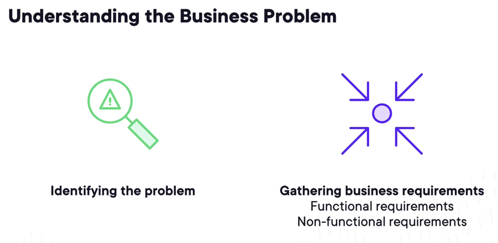
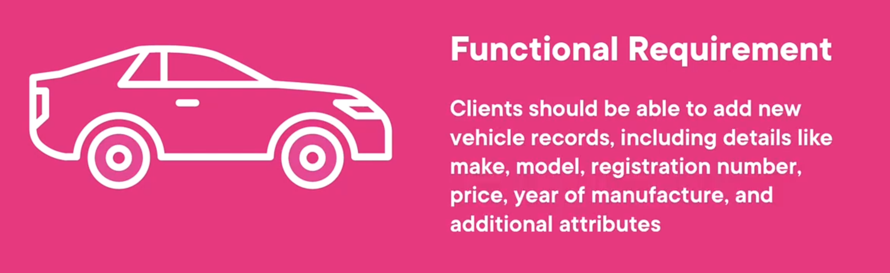
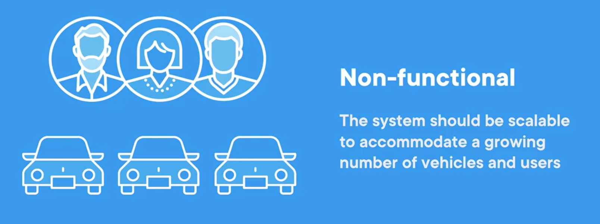
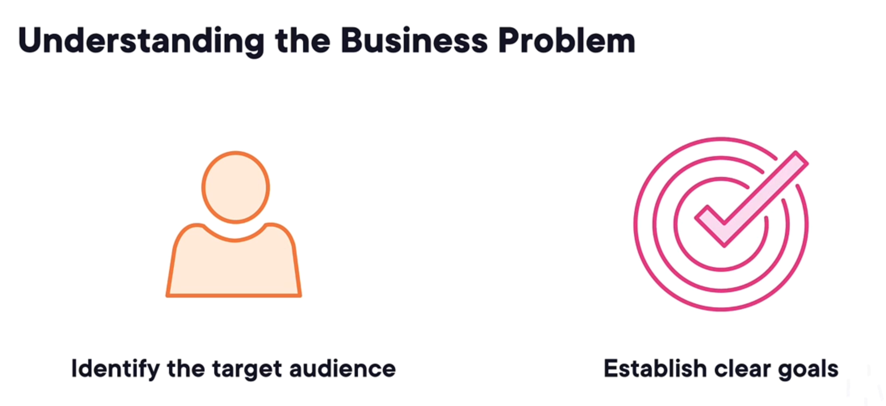
## 3. Exploring the Design Process
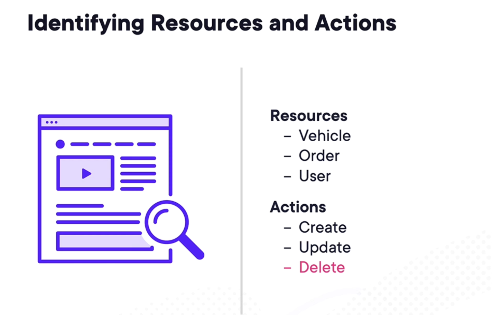
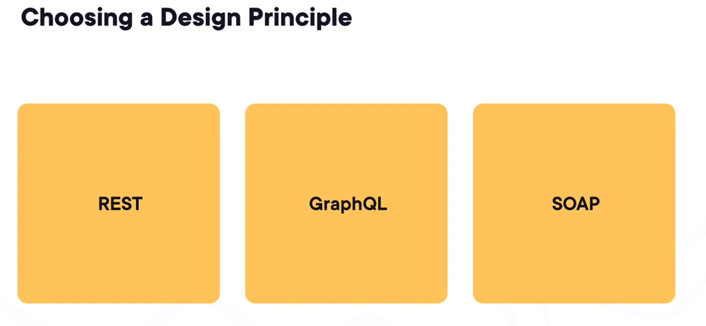
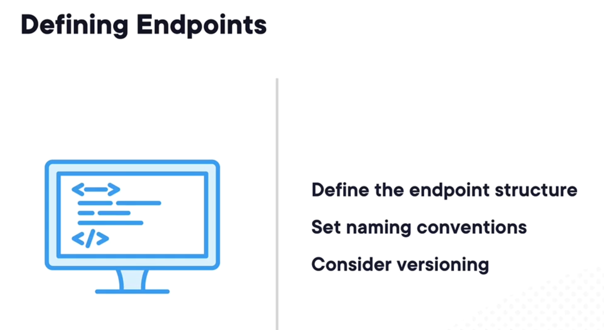
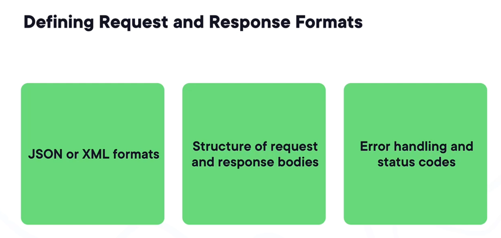
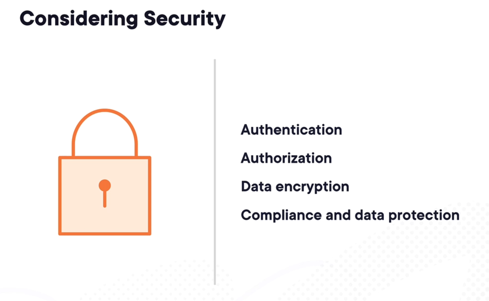
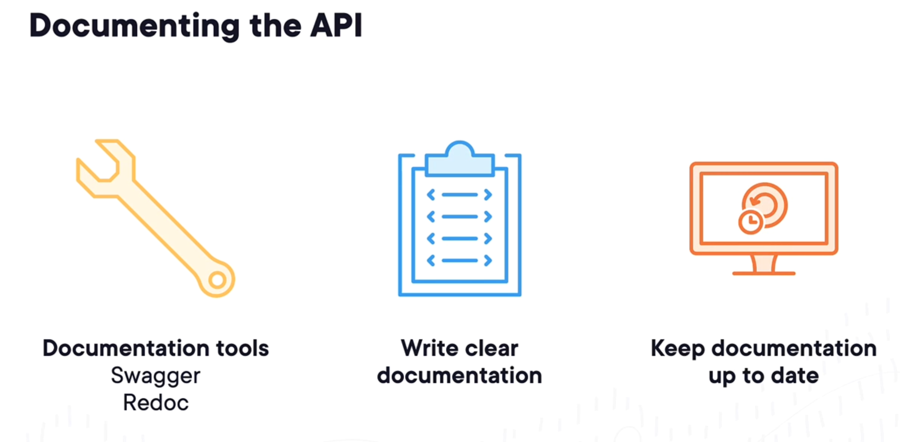
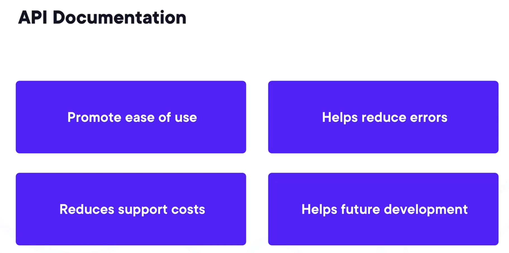
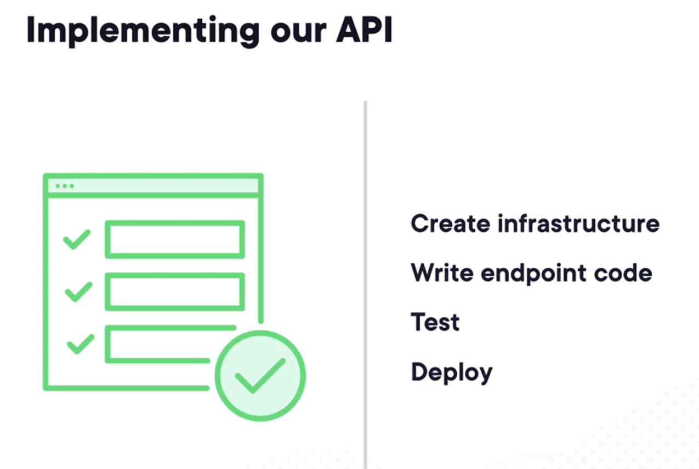
## 4. Demo - Designing an API


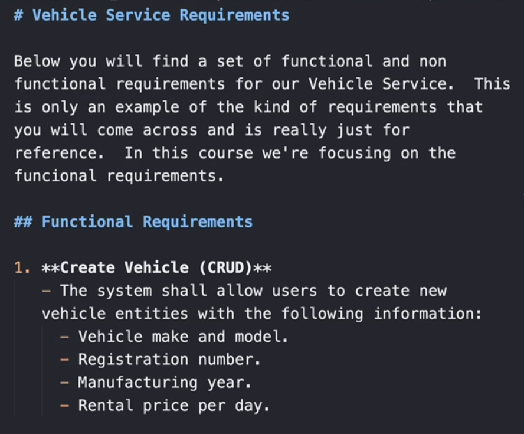
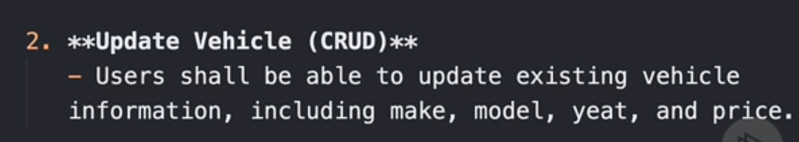
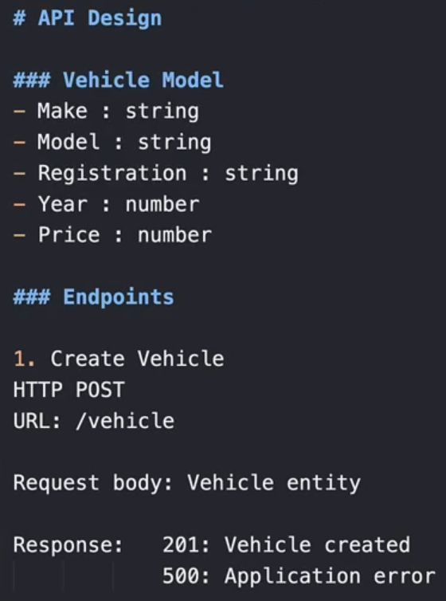
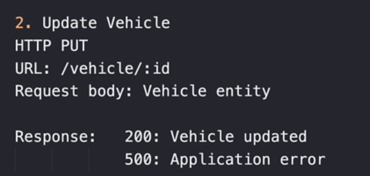
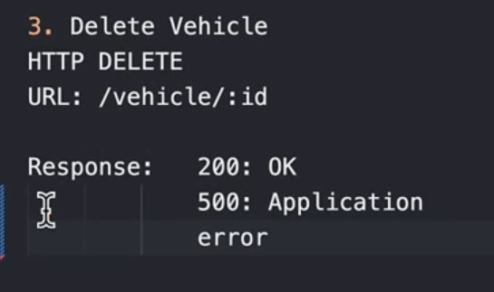
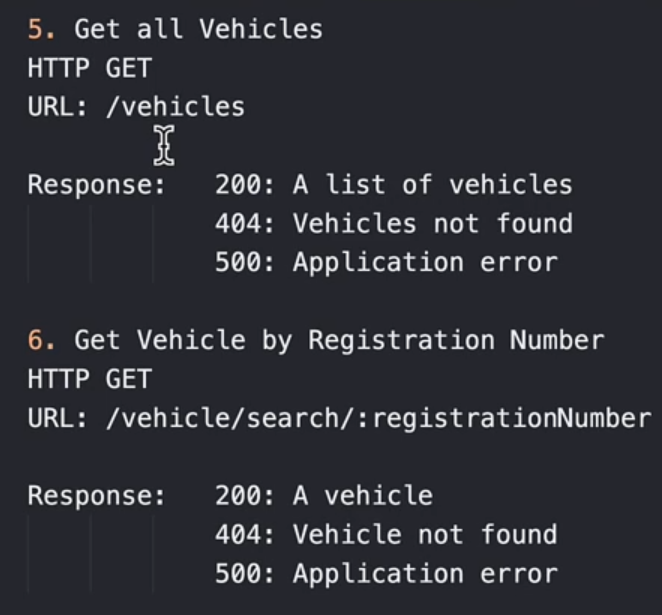
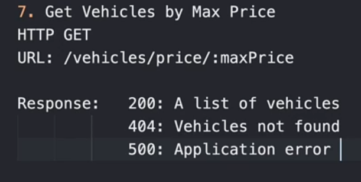
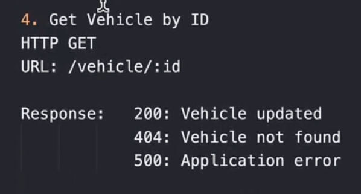