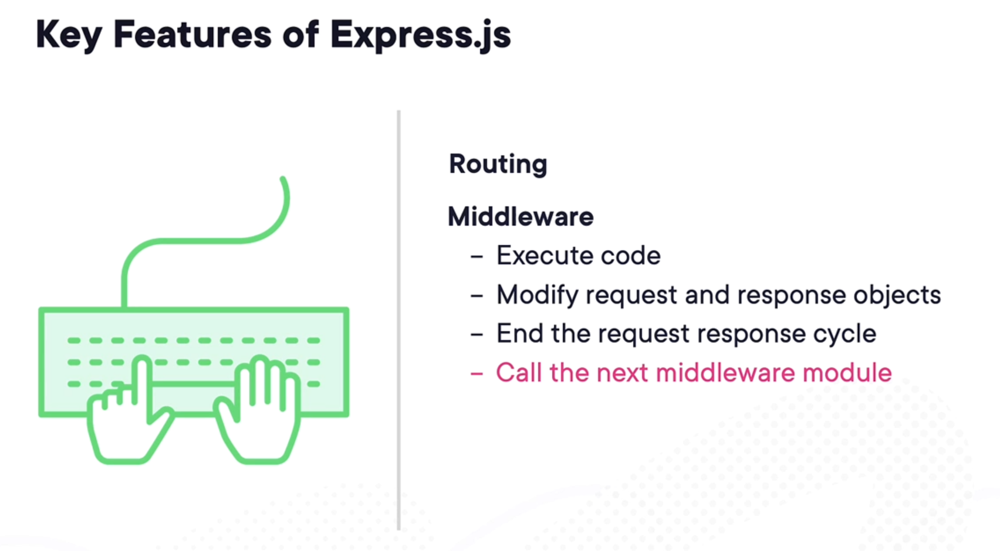
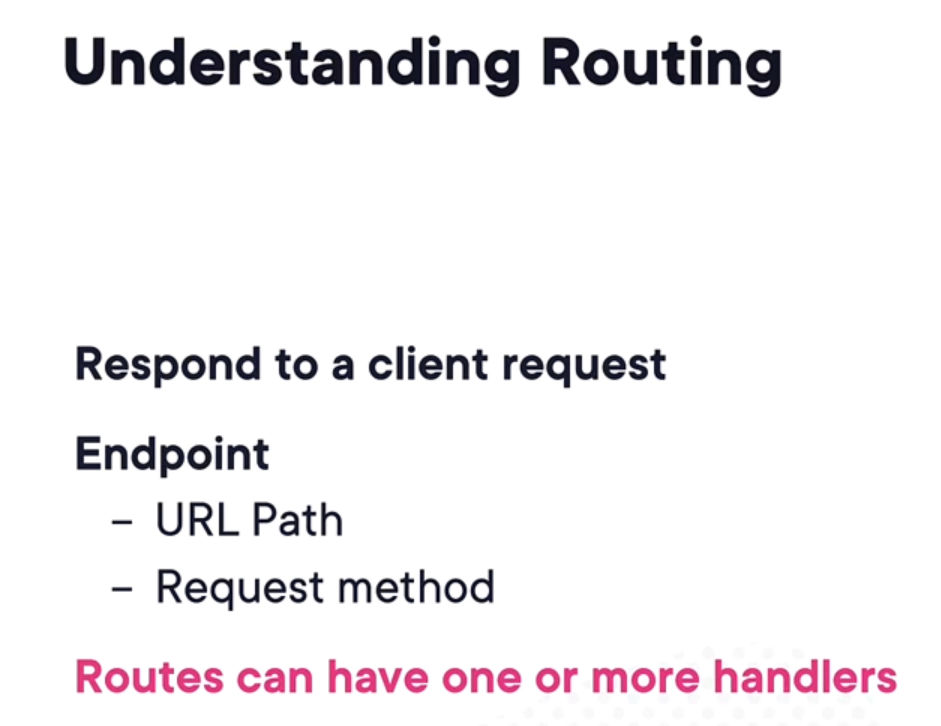
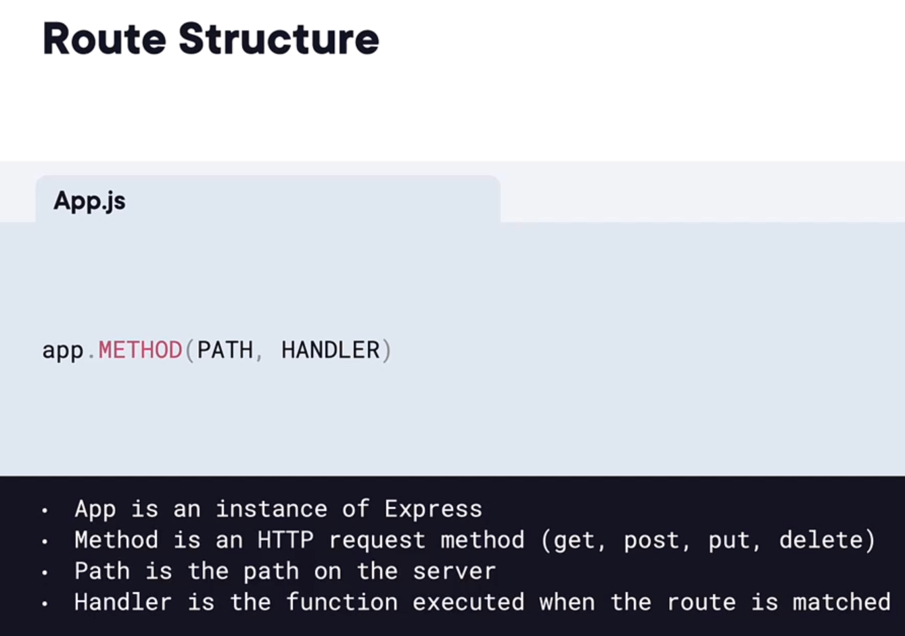
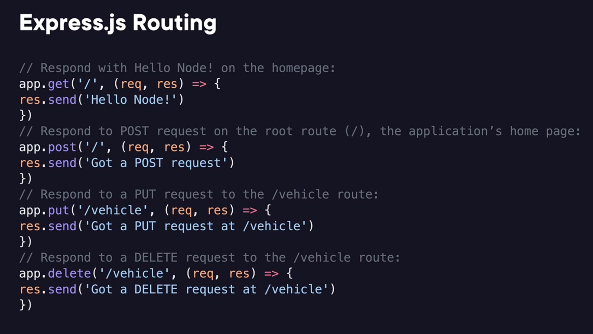
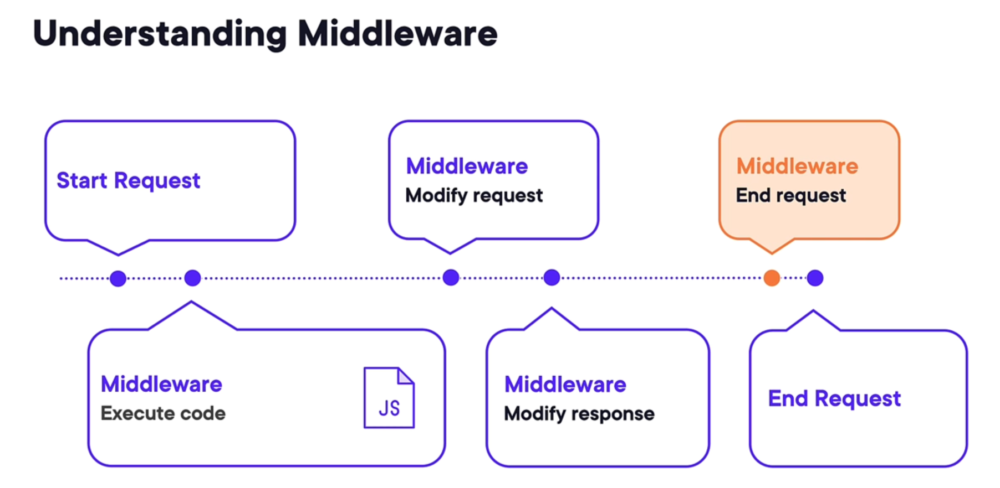
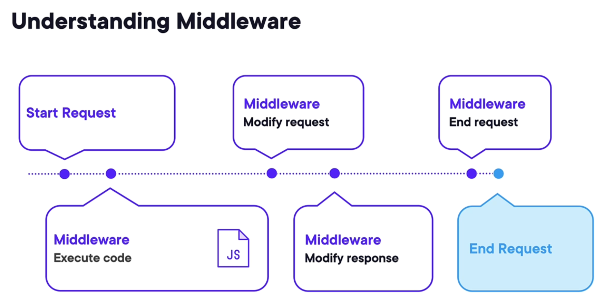
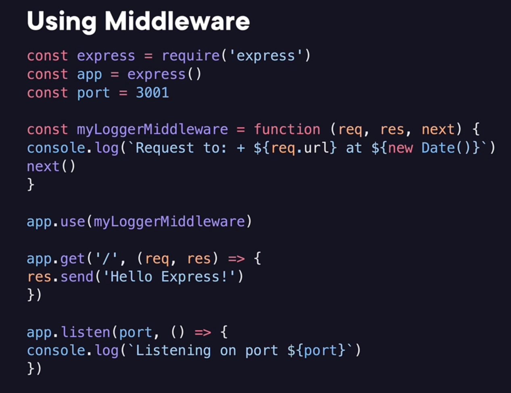
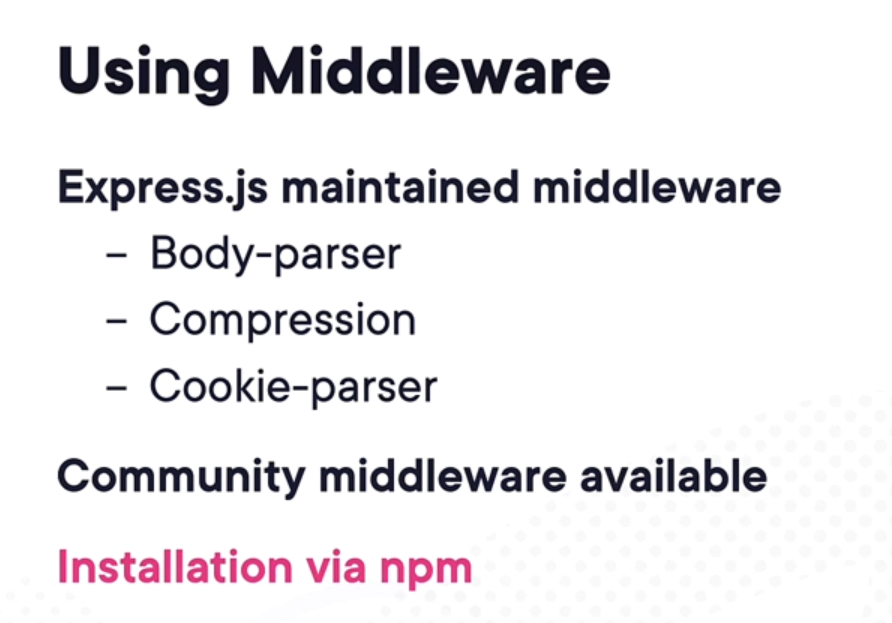

# 5. Building an API

This is the readme file for the 5. Building an API folder.

## 1. Building an API with Express.JS


## 2. Demo - Getting Started with Express.JS


```ts
import express from "express";

const app = express();

app.get("/", (req, res) => {
  res.send("Hello World");
});

const PORT = process.env.PORT || 3000;

app.listen(PORT, () => {
  console.log(`Server is running on http://localhost:${PORT}`);
});

```

## 3. Understanding Express.JS










## 4. Demo - Creating the Vehicle Service API

```ts
{
  "name": "code",
  "version": "1.0.0",
  "main": "index.js",
  "scripts": {
    "watch": "tsc -w",
    "start": "node --watch-path=./dist ./dist/app.js"
  },
  "keywords": [],
  "author": "",
  "license": "ISC",
  "description": "",
  "devDependencies": {
    "@types/express": "^4.17.21",
    "@types/node": "^22.5.5",
    "@types/swagger-jsdoc": "^6.0.4",
    "@types/swagger-ui-express": "^4.1.6",
    "@types/uuid": "^10.0.0",
    "typescript": "^5.6.2"
  },
  "dependencies": {
    "express": "^4.21.0",
    "swagger-jsdoc": "^6.2.8",
    "swagger-ui-express": "^5.0.1",
    "uuid": "^10.0.0"
  }
}

```
```ts
import express from "express";
import swaggerJsDoc from "swagger-jsdoc";
import swaggerUi from "swagger-ui-express";
import vehicleRouter from "./routes/vehicles/routes";
import { swaggerOptions } from "./swagger/swagger.config";

const app = express();

app.use(express.json());
// Generate Swagger documentation using swagger-jsdoc
const swaggerSpec = swaggerJsDoc(swaggerOptions);

// Serve Swagger documentation at /api-docs
app.use("/api-docs", swaggerUi.serve, swaggerUi.setup(swaggerSpec));

app.use("/vehicles", vehicleRouter);

app.get("/", (req, res) => {
  res.send("Hello World");
});

const PORT = process.env.PORT || 3000;

app.listen(PORT, () => {
  console.log(`Server is running on http://localhost:${PORT}`);
  console.log(`Swagger docs available at http://localhost:${PORT}/api-docs`);
});

```
```ts
import { Options } from "swagger-jsdoc";

// Define the basic information about the API
export const swaggerOptions: Options = {
  definition: {
    openapi: "3.0.0",
    info: {
      title: "Express API with Swagger",
      version: "1.0.0",
      description: "A simple CRUD API application with Swagger documentation",
      contact: {
        name: "ccweerasinghe",
        url: "http://localhost:3000",
        email: "ccweerasinghe1994@gmail.com",
      },
    },
    servers: [
      {
        url: "http://localhost:3000", // URL of the API
      },
    ],
  },
  apis: ["./src/routes/vehicles/*.ts"], // Define the paths to your route files where you will document the APIs
};


```
```ts
import Vehicle from "../models/VehicleModel";

const DB: Vehicle[] = [
  new Vehicle("ABC-123", "Toyota", "Corolla", 2019, 100),
  new Vehicle("DEF-456", "Honda", "Civic", 2020, 120),
  new Vehicle("GHI-789", "Suzuki", "Swift", 2018, 90),
  new Vehicle("JKL-012", "Toyota", "Prius", 2021, 150),
  new Vehicle("MNO-345", "Honda", "Accord", 2017, 110),
  new Vehicle("PQR-678", "Suzuki", "Alto", 2016, 80),
  new Vehicle("STU-901", "Toyota", "Camry", 2019, 130),
  new Vehicle("VWX-234", "Honda", "Fit", 2020, 100),
  new Vehicle("YZA-567", "Suzuki", "Wagon R", 2018, 70),
  new Vehicle("BCD-890", "Toyota", "Yaris", 2021, 140),
  new Vehicle("EFG-123", "Honda", "City", 2017, 100),
  new Vehicle("HIJ-456", "Suzuki", "Cultus", 2016, 60),
  new Vehicle("KLM-789", "Toyota", "Vitz", 2019, 110),
  new Vehicle("NOP-012", "Honda", "CR-V", 2020, 130),
  new Vehicle("QRS-345", "Suzuki", "Jimny", 2018, 100),
  new Vehicle("TUV-678", "Toyota", "Land Cruiser", 2021, 200),
  new Vehicle("VWX-901", "Honda", "BR-V", 2017, 120),
  new Vehicle("YZA-234", "Suzuki", "Vitara", 2016, 90),
  new Vehicle("BCD-567", "Toyota", "Fortuner", 2019, 160),
  new Vehicle("EFG-890", "Honda", "Civic", 2020, 120),
  new Vehicle("HIJ-123", "Suzuki", "Swift", 2018, 90),
  new Vehicle("KLM-456", "Toyota", "Prius", 2021, 150),
  new Vehicle("NOP-789", "Honda", "Accord", 2017, 110),
  new Vehicle("QRS-012", "Suzuki", "Alto", 2016, 80),
  new Vehicle("TUV-345", "Toyota", "Camry", 2019, 130),
];

export default DB;

```
```ts
import { v4 as uuidv4 } from "uuid";

class Vehicle {
  id: string;
  registerNumber: string;
  make: string;
  model: string;
  year: number;
  rentalPrice: number;
  constructor(
    registerNumber: string,
    make: string,
    model: string,
    year: number,
    rentalPrice: number
  ) {
    if (
      typeof registerNumber !== "string" ||
      typeof make !== "string" ||
      typeof model !== "string"
    ) {
      throw new Error("registerNumber, make and model must be strings");
    }

    if (typeof year !== "number" || typeof rentalPrice !== "number") {
      throw new Error("year and rentalPrice must be numbers");
    }
    
    this.id = uuidv4();
    this.registerNumber = registerNumber;
    this.make = make;
    this.model = model;
    this.year = year;
    this.rentalPrice = rentalPrice;
  }
}

export default Vehicle;

```
```ts
import {Router} from "express";
import {deleteVehicleById, getAllVehicles, getVehicleById, updateVehicleById} from "../../services/vehicleService";

const vehicleRouter = Router();

/**
 * @swagger
 * /vehicles:
 *   get:
 *     summary: Retrieve a list of vehicles
 *     description: Retrieve a list of vehicles from the database
 *     responses:
 *       200:
 *         description: A list of vehicles.
 *         content:
 *           application/json:
 *             schema:
 *               type: array
 *               items:
 *                 type: object
 *                 properties:
 *                   id:
 *                     type: string
 *                     description: The vehicle ID
 *                   type:
 *                     type: string
 *                     description: The type of vehicle
 *                   model:
 *                     type: string
 *                     description: The model of the vehicle
 *                   year:
 *                     type: integer
 *                     description: The year the vehicle was manufactured
 *                   brand:
 *                     type: string
 *                     description: The brand of the vehicle
 */
vehicleRouter.get("/", getAllVehicles);

/**
 * @swagger
 * /vehicles/{id}:
 *   get:
 *     summary: Retrieve a vehicle by ID
 *     description: Retrieve a specific vehicle from the database using its ID
 *     parameters:
 *       - in: path
 *         name: id
 *         required: true
 *         schema:
 *           type: string
 *         description: The vehicle ID
 *     responses:
 *       200:
 *         description: A vehicle object.
 *         content:
 *           application/json:
 *             schema:
 *               type: object
 *               properties:
 *                 id:
 *                   type: string
 *                   description: The vehicle ID
 *                 type:
 *                   type: string
 *                   description: The type of vehicle
 *                 model:
 *                   type: string
 *                   description: The model of the vehicle
 *                 year:
 *                   type: integer
 *                   description: The year the vehicle was manufactured
 *                 brand:
 *                   type: string
 *                   description: The brand of the vehicle
 */
vehicleRouter.get("/:id", getVehicleById);


/**
 * @swagger
 * /vehicles/{id}:
 *   put:
 *     summary: Update a vehicle by ID
 *     description: Update a specific vehicle from the database using its ID
 *     parameters:
 *       - in: path
 *         name: id
 *         required: true
 *         schema:
 *           type: string
 *         description: The vehicle ID
 *     requestBody:
 *       required: true
 *       content:
 *         application/json:
 *           schema:
 *             type: object
 *             properties:
 *               type:
 *                 type: string
 *                 description: The type of vehicle
 *               model:
 *                 type: string
 *                 description: The model of the vehicle
 *               year:
 *                 type: integer
 *                 description: The year the vehicle was manufactured
 *               brand:
 *                 type: string
 *                 description: The brand of the vehicle
 *     responses:
 *       200:
 *         description: Vehicle updated successfully
 *       404:
 *         description: Vehicle not found
 */
vehicleRouter.put("/:id", updateVehicleById)


/**
 * @swagger
 * /vehicles/{id}:
 *   delete:
 *     summary: Delete a vehicle by ID
 *     description: Delete a specific vehicle from the database using its ID
 *     parameters:
 *       - in: path
 *         name: id
 *         required: true
 *         schema:
 *           type: string
 *         description: The vehicle ID
 *     responses:
 *       200:
 *         description: Vehicle deleted successfully
 *       404:
 *         description: Vehicle not found
 */
vehicleRouter.delete("/:id", deleteVehicleById)


export default vehicleRouter;

```
```ts
import {RequestHandler} from "express";
import DB from "../data/seedData";
import Vehicle from "../models/VehicleModel";

// Define the interface for request parameters and query parameters
interface Params {
    id: string; // Route parameter
}

interface Query {
    type?: string; // Optional query parameter
}

type TErrorResponse = { message: string };

type TResponseBody = Vehicle[] | TErrorResponse;
type TRequestBodyGetAllVehicles = Vehicle | TErrorResponse;

const getAllVehicles: RequestHandler<
    Params,
    TResponseBody,
    any,
    Query
> = async (_req, res) => {
    try {
        const getData = DB;
        return res.json(getData);
    } catch (error) {
        if (error instanceof Error) {
            return res.status(500).send({message: error.message});
        }
        res.status(500).send({message: "Internal Server Error"});
    }

    return res.json(DB);
};


const getVehicleById: RequestHandler<Params, TRequestBodyGetAllVehicles, any, any> = async (req, res) => {

    try {
        const {id} = req.params;

        const findIndex = DB.findIndex((vehicle) => vehicle.id === id);

        if (findIndex === -1) {
            return res.status(404).send({message: "Vehicle not found"});
        }

        const vehicle = DB.find((vehicle) => vehicle.id === id);

        return res.json(vehicle);
    } catch (error) {
        if (error instanceof Error) {
            return res.status(500).send({message: error.message});
        }
        res.status(500).send({message: "Internal Server Error"});
    }

}

type updateVehicleByIdResponseBody = void | TErrorResponse;

const updateVehicleById: RequestHandler<Params, updateVehicleByIdResponseBody, Omit<Vehicle, 'id'>, any> = async (req, res) => {

    try {
        const {id} = req.params;
        const {model, year, registerNumber, rentalPrice, make} = req.body;

        const findIndex = DB.findIndex((vehicle) => vehicle.id === id);

        if (findIndex === -1) {
            return res.status(404).send({message: "Vehicle not found"});
        }

        DB[findIndex] = {
            id,
            model,
            year,
            registerNumber,
            rentalPrice,
            make
        };

        return res.status(204).send();

    } catch (error) {
        if (error instanceof Error) {
            return res.status(500).send({message: error.message});
        }
        res.status(500).send({message: "Internal Server Error"});
    }
}

type deleteVehicleByIdResponseBody = void | TErrorResponse;
const deleteVehicleById: RequestHandler<Params, deleteVehicleByIdResponseBody, any, any> = async (req, res) => {

    try {
        const {id} = req.params;

        const findIndex = DB.findIndex((vehicle) => vehicle.id === id);

        if (findIndex === -1) {
            return res.status(404).send({message: "Vehicle not found"});
        }

        DB.splice(findIndex, 1);

        return res.status(204).send();

    } catch (error) {
        if (error instanceof Error) {
            return res.status(500).send({message: error.message});
        }
        res.status(500).send({message: "Internal Server Error"});
    }


}

export {getAllVehicles, getVehicleById, updateVehicleById, deleteVehicleById};

```
```ts

```
## 5. Hosting a Micro Service

## 6. Demo - Deploying a Micro Service

