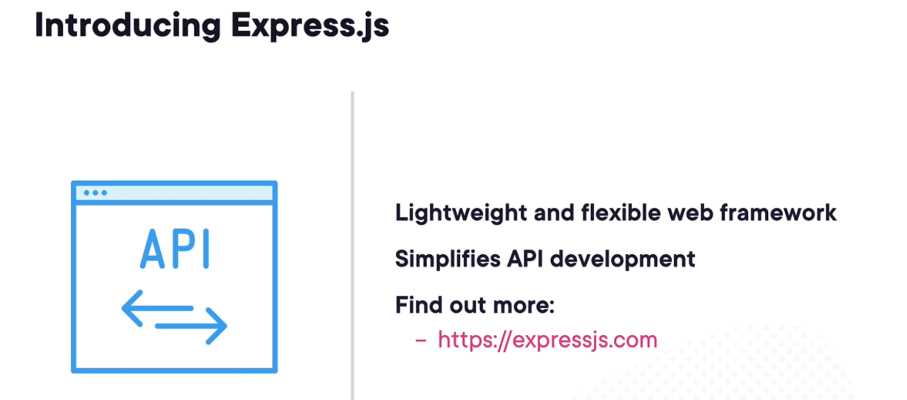
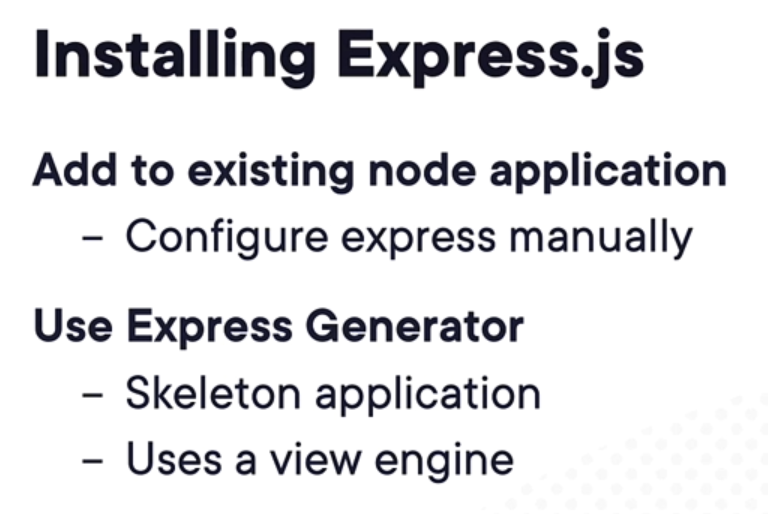
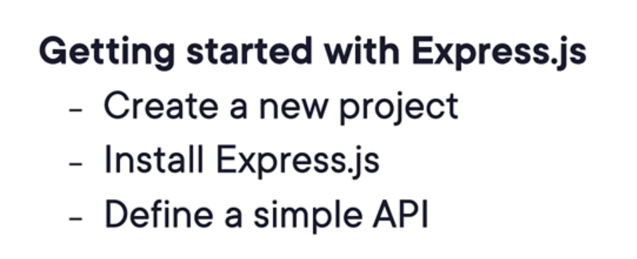

# 5. Building an API

This is the readme file for the 5. Building an API folder.

## 1. Building an API with Express.JS

## 2. Demo - Getting Started with Express.JS

## 3. Understanding Express.JS

## 4. Demo - Creating the Vehicle Service API

## 5. Hosting a Micro Service

## 6. Demo - Deploying a Micro Service

